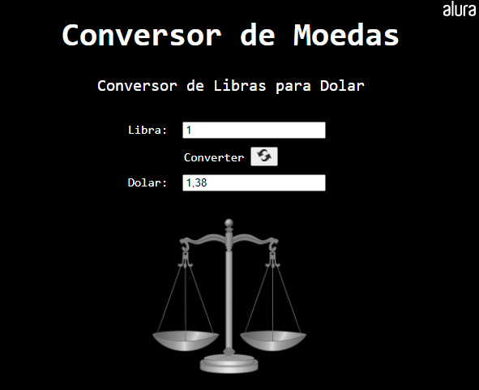
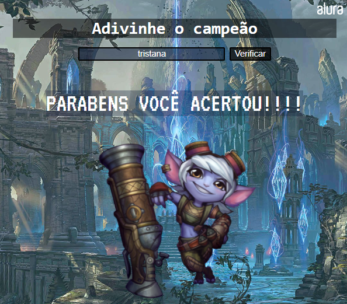
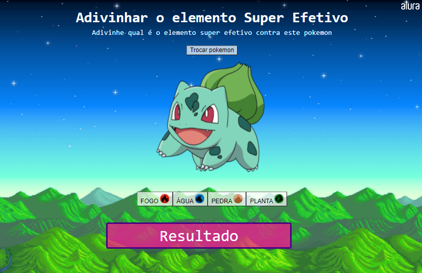

<h1> Projeto para Acompanhar a ImersãoDev da Alura  </h1>

<blockquote align=right>  Repositorio com a resolução dos desafios propostos na Imersão. </blockquote> 

<h2> Desafio 1: Conversor de moedas </h2>
<h4><li> Criar um programa que converta libra em dolar.</li></h4>
<h4><li> Exibir o resultado da conversão na tela, no lugar da função alert.</li></h4>
 
<blockquote align=center>Link para a resolução do desafio através do Codepen  
<b><a href='https://codepen.io/zThanael/pen/WNRNvzL'> Clique aqui </a></b>  
<i> Imagem da tela <i>    </blockquote align=center>
  

<h2> Desafio 2: Adivinhe o campeão League of Legends </h2> 
<h4><li> Exibir algo na tela e pedir para o usuario escrever o nome desse objeto.</li></></h4>
<h4><li> Exibir se acertou ou errou o nome.</li></blockquote></h4>
 
<blockquote align=center>Link para a resolução do desafio através do Codepen  
<b><a href='https://codepen.io/zThanael/pen/abpzjBm'> Clique aqui </a></b>  
<i> Imagem da tela <i>    </blockquote align=center>

<h2> Desafio 3: Adivinhe qual elemento será super efetivo contra este pokemon </h2> 
<h4><li> Alterar o math.random() para funcionar com outros intervalos entre números.</li></h4>
<h4><li> Modifique o cenário do mentalista e adicione mecanismos de chances, pontos e etc!.</li></blockquote></h4>
 
<blockquote align=center>Link para a resolução do desafio através do Codepen  
<b><a href='https://codepen.io/zThanael/pen/ExZPPRX'> Clique aqui </a></b>  
<i> Imagem da tela <i>    </blockquote align=center>

